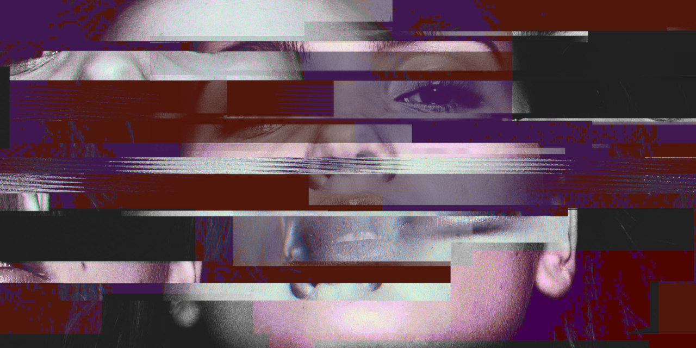

**NOTE: THIS DOCUMENTATION IS NOT WORK IN PROGRESS. THERE MAY BE PAGES MISSING OR EMPTY.**

# Rubbergoddess

This Discord bot manages verification process, users, karma and some other functionality on [VUT FEKT][invite] Discord server.

## List of features

- Karma (via server and unicode emojis)
- Verification (via e-mails)
- React-to-role (with permission management and support for school subject channels)
- Management tools: Purge, Whois
- Dynamic voice channels
- ?pick, ?flip, ?picsum (random Unsplash picture)
- ?weather, ?nameday
- And more: see [full command list](cogs/index.md)

## Related bots
[Rubbergod], maintained by VUT FIT team. Rubbergoddess is younger, but more mature sister -- originally forked, now independent.

[Amadeus], mantained by [Czechbol]. Younger brother, sharing a lot of core code from before the v0.1.0 release. It complements Rubbergoddess with functions like vote, graph, latex or message leaderboards.

[Wormhole]. Discord bot connecting multiple guilds with one shared chat.

# Authors

Rubbergoddess is mantained by [sinus-x], with occasional help from [Czechbol].

Original (Rubbergod) authors include [Toaster](https://github.com/toaster192), [Matthew](https://github.com/matejsoroka), [Fpmk](https://github.com/TheGreatfpmK), [peter](https://github.com/peterdragun), [Urumasi](https://github.com/Urumasi) or [Leo](https://github.com/ondryaso).

# License

This project is licensed under the GNU GPL v.3 License.

Rubbergoddess image is a CC0 photography by Peter Sjo hosted on [unsplash.com](https://unsplash.com/photos/Nxy-6QwGMzA).

[invite]: https://discord.com/invite/9N3cP2E
[sinus-x]: https://github.com/sinus-x
[Czechbol]: https://github.com/Czechbol
[Rubbergod]: https://github.com/Toaster192/rubbergod
[Amadeus]: https://github.com/Czechbol/Amadeus
[Wormhole]: https://github.com/sinus-x/discord-wormhole
